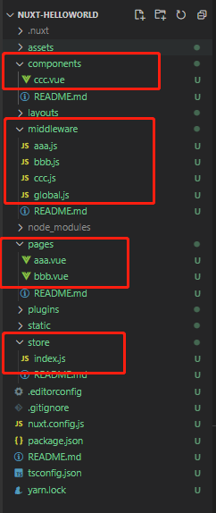
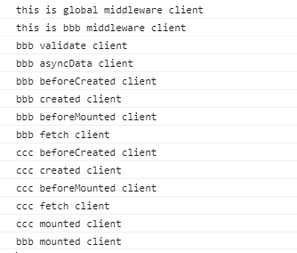

## 错误理解：asyncData 只在server端运行

当页面第一次加载或者浏览器上刷新页面时，asyncData 是在server端运行。

通过路由跳转时，asyncData 都是在client端运行。

类似Nuxt中间件，当页面第一次加载或者浏览器上刷新页面时，~~Nuxt中间件会在server端和client端运行~~  Nuxt中间件 只在server端运行，通过路由跳转时，Nuxt中间件 只在client端运行。


## 错误理解：使用a标签跳转页面

我没接触过Nuxt时的理解：既然要服务端渲染，项目就不能是spa了，因为我的理解就是每个页面都要从服务端拿，所以一定是多页应用程序。

现在的理解：Nuxt 是一个 spa 应用，也就是 Nuxt 的路由跳转都是局部刷新。

```javascript
// 不要用下面的方法，浏览器重新加载，加载变慢
// html: <a href="/shop/cart">购物车</a>
window.location.href = path

// 正确使用
// html: <nuxt-link to="/shop/cart">购物车</nuxt-link>
this.$router.push({ path })
```


## 错误理解：当页面第一次加载或者浏览器上刷新页面时，Nuxt中间件会在server端和client端运行

我刚接触Nuxt的时候，陶智对我说 :smile:，当页面第一次加载或者浏览器上刷新页面时，Nuxt中间件会在server端和client端运行。

现在的理解：当页面第一次加载或者浏览器上刷新页面时，Nuxt中间件 只在server端运行，通过路由跳转时，Nuxt中间件 只在client端运行。

借这个机会，写个小demo，梳理下Nuxt的生命周期

### 案例分析

主要文件如下



页面aaa.vue:

```vue
<template>
  <div class="container">
    this is aaa
    <Ccc></Ccc>
    <nuxt-link to="/bbb">bbb</nuxt-link>
  </div>
</template>
<script>
export default {
  middleware: "aaa",
  asyncData() {
    console.log("aaa asyncData", process.server ? "server" : "client");
  },
  validate() {
    console.log("aaa validate", process.server ? "server" : "client");
    return true;
  },
  fetch() {
    console.log("aaa fetch", process.server ? "server" : "client");
  },
  beforeCreate() {
    console.log("aaa beforeCreated", process.server ? "server" : "client");
  },
  created() {
    console.log("aaa created", process.server ? "server" : "client");
  },
  beforeMount() {
    console.log("aaa beforeMounted", process.server ? "server" : "client");
  },
  mounted() {
    console.log("aaa mounted", process.server ? "server" : "client");
  }
};
</script>
```

页面 bbb.vue

```vue
<template>
  <div class="container">
    this is bbb
    <Ccc></Ccc>
  </div>
</template>
<script>
export default {
  middleware: "bbb",
  asyncData() {
    console.log("bbb asyncData", process.server ? "server" : "client");
  },
  validate() {
    console.log("bbb validate", process.server ? "server" : "client");
    return true;
  },
  fetch() {
    console.log("bbb fetch", process.server ? "server" : "client");
  },
  beforeCreate() {
    console.log("bbb beforeCreated", process.server ? "server" : "client");
  },
  created() {
    console.log("bbb created", process.server ? "server" : "client");
  },
  beforeMount() {
    console.log("bbb beforeMounted", process.server ? "server" : "client");
  },
  mounted() {
    console.log("bbb mounted", process.server ? "server" : "client");
  }
};
</script>
```

组件ccc.vue:

```vue
<template>
  <div class="container">
    this is ccc
  </div>
</template>
<script>
export default {
  middleware: "ccc",
  asyncData() {
    console.log("ccc asyncData", process.server ? "server" : "client");
  },
  validate() {
    console.log("ccc validate", process.server ? "server" : "client");
    return true;
  },
  fetch() {
    console.log("ccc fetch", process.server ? "server" : "client");
  },
  beforeCreate() {
    console.log("ccc beforeCreated", process.server ? "server" : "client");
  },
  created() {
    console.log("ccc created", process.server ? "server" : "client");
  },
  beforeMount() {
    console.log("ccc beforeMounted", process.server ? "server" : "client");
  },
  mounted() {
    console.log("ccc mounted", process.server ? "server" : "client");
  }
};
</script>
```

中间件：

```js
// middleware/aaa.js
export default function({ssrContext,redirect,store,route}) {
  console.log('this is aaa middleware', process.server ? 'server' : 'client')
}
// middleware/bbb.js
export default function({ssrContext,redirect,store,route}) {
  console.log('this is bbb middleware',process.server?'server':'client')
}
// middleware/ccc.js
export default function({ssrContext,redirect,store,route}) {
  console.log('this is global middleware',process.server?'server':'client')
}
// middleware/global.js
export default function({ssrContext,redirect,store,route}) {
  console.log('this is global middleware',process.server?'server':'client')
}
```

NuxtServerLint:

```js
export const actions = {
  nuxtServerInit() {
    console.log('this is nuxtServerInit', process.server ? 'server' : 'client');
  }
}
```


当我们在浏览器中输入/aaa时


当我们从页面aaa，跳转到页面bbb时



注意中间件只执行一次，如果用 process.client 或 process.server 括起来的代码，只会执行其中一个。


## 最后更新时间 2021/4/26，会持续更新下去的

