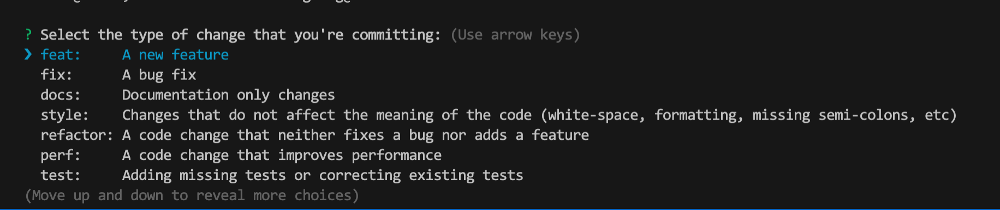
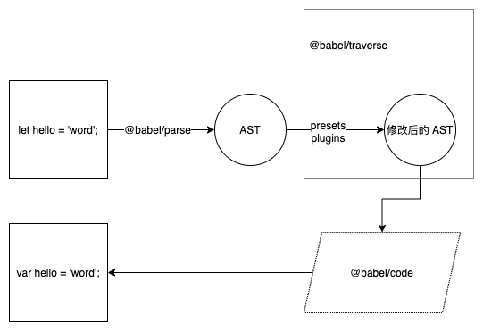

> 君子生非异也 善假于物也 - 荀子

一个项目从创建到发布的整个生命周期里，在各个环节都是有许多工具的，它们或用于规范代码、或用于实现一些自动化的操作等等，本篇文章将分享个人使用过或了解过的这些工具。

## 项目创建工具

一般来说，新的 Web 项目现阶段基本离不开三大框架。三大框架都有对应的 CLI 工具供我们来使用，React 使用 [create-react-app](https://github.com/facebook/create-react-app)，Vue 使用 [vue-cli](https://github.com/vuejs/vue-cli), Angular 使用 [angular-cli](https://github.com/angular/angular-cli)。当然还有很多相对来说比较小众的框架，比如 [svelte](https://github.com/sveltejs/svelte)、[preact](https://github.com/preactjs/preact)、[riot](https://github.com/riot/riot) 等等，它们都是有提供对应的 CLI 工具的。

除开这些 CLI 工具，还有一种方式就是使用模板项目，比如在 Github 上我们可以搜索带 `seed`、`boilerplate`、`template` 等类似带样板、模板的项目名。而且现在 Github 官方也推出了可以在设置中标记项目为模板项目(template repository)的配置[^1]。这些模板项目由于一般都是非官方的项目，所以需要我们从 star 数量、fork 数量、issues 的维护情况、发版频率、讨论热度、测试覆盖率等等指标方面去做筛选，以避免踩坑。

还有一种情况，就是这些现成的架子不能满足我们的需求，需要我们自己去搭建的，事实上也就是我们这篇文档后续将要讨论的一些工具。怎么样去搭建项目是没有一个事实上的标准的，但是有许多形成了共识的东西是可以参考的，非必要不采用一些不常见的形式，尽量降低其他人的参与成本。比如说目录结构，一般可以参考以下的组织形式：

```base
.
|-- bin   存放一些可执行文件（binary 简写）
|-- buid  存放一些构建脚本
|-- examples  存放一些示例代码
|-- dist  存放打包之后的文件
|-- test  存放测试文件
|-- docs  存放项目的文档
|-- src   存放源文件
|    |-- assets 存放静态资源，比如图片、字体等
|    |-- utils  存放工具函数
|    |-- components  存放组件
|    |-- constants  存放一些常量文件
|    |-- pages  或者叫 views, 存放页面文件
...
```

当然，对于特殊的项目或者项目内部的更细致的划分不能一一列举。命名尽量简单、自然，让后续的参与者能从字面意思了解到这是干什么的。

对于比较大的项目，需要拆分为多个小项目，而且小项目之前又有较强的依耐性的这种需求，可以使用 [lerna](https://github.com/lerna/lerna) 这样的工具去进行管理。

如果公司经常需要创建新项目，可以考虑写一个公司内部的脚手架，如果是用 Node 写脚手架，下面介绍的这些包可能派的上用场:

- [commander.js](https://github.com/tj/commander.js) 用于参数解析与命令注册
- [Inquirer.js](https://github.com/SBoudrias/Inquirer.js) 交互式命令行工具
- [chalk](https://github.com/chalk/chalk) 终端输出美化
- [ora](https://github.com/sindresorhus/ora) 终端加载效果
- [download-git-repo](https://gitlab.com/flippidippi/download-git-repo) 下载远程仓库
- [shelljs](https://github.com/shelljs/shelljs) shell 命令的 JS 封装

如果嫌拼装这些工具麻烦，写 CLI 也是有框架的，比如 [oclif](https://github.com/oclif/oclif)、[yargs](http://yargs.js.org/) 。

## 版本管理工具

现阶段， Git 已成为大多数项目的管理工具。所以介绍一些 Git 相关的工具。

在项目中有些目录或者文件是不需要进行管理的，这时我们可以使用 `.gitignore` 把这些文件和目录进行忽略。这里我们可以使用 [gitignore.io](https://www.toptal.com/developers/gitignore) 来创建它，该工具把针对特定语言或者系统需要忽略的常见的文件都写了进去，免得后续维护。

要介绍的关于 Git 的第二个工具是关于规范提交信息的。目前，比较推荐的提交规范是 Angular 团队提出的一个规范，具体的规则可参考这个文档。[Angular 提交信息规范](https://zj-git-guide.readthedocs.io/zh_CN/latest/message/Angular%E6%8F%90%E4%BA%A4%E4%BF%A1%E6%81%AF%E8%A7%84%E8%8C%83/)([官方链接](https://github.com/angular/angular.js/blob/master/DEVELOPERS.md#-git-commit-guidelines))。在日常开发过程中记住这些规范可能有些繁琐，这时我们可以使用 [cz-cli](https://github.com/commitizen/cz-cli) 命令行工具，安装完成后，使用 `git cz` 来替代 `git commit` 命令，它会启动一个交互式的界面来引导你输入此次提交干了些什么，如下图：



使用这样的工具我们就不会因为不记得规范而忘记遵循规范了。关于提交信息的更多细节可以参考下 "[Commit message 和 Change log 编写指南](http://www.ruanyifeng.com/blog/2016/01/commit_message_change_log.html)" 这篇文章。

关于 Git 的最后一个工具是一个用于增加我们提交信息的趣味性的工具： [gitmoji](https://github.com/carloscuesta/gitmoji) 。我们经常可以在 Github 上看到一些项目的提交信息里有 emoji 表情，实际上这只要我们在提交信息里输入对应的 emoji 编码（打开 gitmoji 网站就能看到），而展示平台（如 Github）支持显示这样的 emoji 编码就能做到。gitmoji 主要是写了一些约定，让 emoji 表情除了有趣还另有含义。

## 编码工具

Web 前端的编码工作主要涉及到三个方面: JS、CSS、HTML，针对这三个不同的方面我们分别介绍。

### JS 编码工具

就目前而言，大多数项目已使用 ES6 及一些更新版本的特性来写 JS、或者使用 TS。但是由于浏览器还未完全的实现所有特性，这就使得我们写的代码与最终运行的代码需要某种转换操作。 在当前阶段最流行的工具就是 [Babel](https://www.babeljs.cn/) ，稍后我们将重点介绍下它。除了 Babel 之外还有其它的编译工具，比如用 Rust 写的宣称更快的 [swc](https://github.com/swc-project/swc)、比如 [ acorn](https://github.com/acornjs/acorn) 等等。

Babel 最核心的包是 [@babel/parser](https://babeljs.io/docs/en/babel-parser)，该包用于解析我们写的源码，转换为 AST （抽象语法树），通过给开发者预留各种插件钩子，使得开发者能够对源码树做各种各样的修改，最后再将 AST 转成 代码。大致流程可参考下图：



其中 `presets` 和 `plugins` 这两个概念我发现时常有些人弄不清。比如说 `@babel/plugin-transform-arrow-functions` 这是一个转换箭头函数的插件，也就是说你在源码中写的箭头函数，通过该插件转换后将会变成符合箭头函数特性的普通函数的写法。插件就是做一些语法转换的事情。那 `preset` 做什么呢？像我们现在写代码的会使用很多新特性，如箭头函数、Class、async/await、装饰器等等，基本上这一个特性就是一个插件，需要配置如此多的插件是很繁琐的，所以 babel 就提供了 `preset` 这种偷懒的方式。如 `@babel/preset-env` 这个 `preset` 就包含我在上面提到的一些插件及更多其它常用的插件。

### CSS 编码工具

CSS 的工具，似乎这几年也没有大的变化，但是还是在这里列举一下吧。

基本上现在写样式都使用预编译语言，比如 [sass](https://sass-lang.com/)、[less](http://lesscss.org/)、[stylus](https://stylus-lang.com/) 。由于长期使用 `sass` ，所以除了知道在语法上它们三者有所区别，更深入的区别就不知道了。

以上三个工具都是为了改善 CSS 在可编程性上的不足的，一般我们还配合使用 [postcss](https://postcss.org/) 对 CSS 做一些修改操作，比如使用 `postcss` 的 [autoprefixer](https://github.com/postcss/autoprefixer) 插件来生成兼容多浏览器的样式。又比如使用 [postcss-pxtorem](https://github.com/cuth/postcss-pxtorem) 来自动转换 px 到 rem。这里特别要提到的一个插件就是 [tailwindcss](https://tailwindcss.com/) ，它发明了一种原子式的思想写样式的方法，小小的实践过一次，确实有些可取之处，感兴趣的可以去关注下。

关于 CSS 的另外一大困惑就是怎么取名字的问题，看似很简单，实际上开发的时候想名字确实是抓耳挠腮。对此，业界也给了些方案，比如又臭又长的 [BEM](http://getbem.com/introduction/) 规范，又比如我习惯使用的一个 BEM 改良版的 [rscss](https://rscss.io/) 规范。还有 [css-modules](https://github.com/css-modules/css-modules) 引入作用域的类似的做法，大大改善了取名总想着不能全局冲突的心智负担。当然，如果是使用 Vue ，框架已经自带了样式的 `scoped` 配置，就更方便了。

### HTML 编码工具

HTML 方面的工具使用不多，就简单列几个模板引擎，如 [pug](https://pugjs.org/api/getting-started.html) (原来叫 Jade)、[ejs](https://ejs.co/)、[handlebarsjs](https://handlebarsjs.com/) ，还有国内常使用的 [art-template](https://aui.github.io/art-template/zh-cn/) 。

## 打包工具

就现阶段而言，大多数项目的打包工具是 [webpack](https://webpack.js.org/) ，webpack 使用 AST 做依赖分析来打包的思路也引发了一些打包工具的创造，如以 [Tree shaking](https://developer.mozilla.org/zh-CN/docs/Glossary/Tree_shaking) 作为卖点推出的 [rollup](https://rollupjs.org/) （webpack2 就已引入该特性），以零配置为卖点的 [parcel](https://parceljs.org/) 等等。

随着浏览器 [native ES modules](https://developer.mozilla.org/en-US/docs/Web/JavaScript/Guide/Modules) 的支持度的提高，基于此来加快本地开发速度而推出的打包工具正在蓬勃发展，如 [Snowpack](https://www.snowpack.dev/)、 [Vite](https://vitejs.dev/)。当然其最核心的依赖分析思路还是和 webpack 类似。

事实上在 webpack 之前也是有几个打包工具相当流行的，比较年轻的前端开发者可能是未使用过的，如 [Grunt](https://gruntjs.com/)、[Gulp](https://gulpjs.com/)，还有国内较流行的 [FIS](https://fis.baidu.com/)。这些工具的思路实际上是在单个文件层面做工作，以用户的配置为依据对文件进行编译、整合、压缩等等处理。这和 webpack 从入口开始进行依赖分析，配合各种 loader 、plugin 在项目层面进行工作有相当大的差别。因为对于大多数 Web 项目来说使用 webpack 这种方式打包更适合，所以 webpack 替代了它们的位置。但是不流行不代表就一无是处了，如果项目更适合在文件层面进行打包，那可能得考虑考虑 Gulp，而不是杀鸡焉用牛刀的选用 webpack。

## 测试工具

实际上国内写业务项目，应该基本不写测试的。但是在写一些基础项目的时候，测试是有必要的。

前端测试的工具还是挺多的，如 [mochajs](https://mochajs.org/)、[jasmine](https://jasmine.github.io/)、 [jestjs](https://jestjs.io/zh-Hans/) 等等，以我个人使用的体验来说， Jest 是最省事的。当然实际我也就用过 Mocha 和 Jest ，Mocha 需要额外引入断言库如 Chai，做 Dom 相关的测试还需要借助其它的工具如 Karma 。Jest 省事的就是这些全都集成了。

我认为写测试实际上是相当值得投入精力去做的事情。想着我们经常战战兢兢的修改代码，就怕一小点改动引发其他的问题，如果写了测试用例，提交代码之前跑一遍，看着满屏的通过，大概率不会有这种对未知的恐惧了。

针对一些人经常在提交代码前忘记运行测试的问题，我们可以使用 [husky](https://github.com/typicode/husky) + [lint-staged](https://github.com/okonet/lint-staged) ，只要我们做提交的操作，配置好的钩子任务就会运行（这里就是运行测试），可参考的配置如下（提交前使用 ESLint 做代码检查也可效仿此做法）：

```json
{
   "scripts" {
     "test": "jest",
   },
   "husky": {
     "hooks": {
       "pre-commit": "lint-staged"
     }
   },
   "lint-staged": {
     "**/*.js": [
       "yarn test"
     ]
   },
}
```

## 代码检查工具

代码检查工具一方面用于统一代码外在的风格（是否要分号、tab 长度等），另一方面用于发现一些低级的代码质量问题（未使用的变量、两个等号等等）。

针对代码外在风格问题，目前阶段基本上以 [prettier](https://prettier.io/) 为实践标准了。如果不是历史原因，不建议额外配置 prettier 的规则，因为这样做更容易统一风格。而且建议配合编辑器或者 IDE 的插件使用，保存时自动格式化。如 VsCode 参考配置如下（需安装 [prettier-vscode](https://marketplace.visualstudio.com/items?itemName=esbenp.prettier-vscode) 插件）：

```json
{
  ...
  // 默认的格式化工具 prettier
  "editor.defaultFormatter": "esbenp.prettier-vscode",
  // 保存的时候自动格式化
  "editor.formatOnSave": true,
  ...
}
```

针对代码质量问题，目前阶段基本上是使用 [ESLint](https://eslint.org/)。ESlint 的原理实际上也是和 Babel 类似，也是将源码解析为 AST，再应用不同的插件来做语法检查。一般我们都是使用现成的检查规则，比如比较严格的 [airbnb/javascript](https://github.com/airbnb/javascript) 规则。国内的规则比较推荐 [AlloyTeam/eslint-config-alloy](https://github.com/AlloyTeam/eslint-config-alloy) 的规则。项目的 ESLint 规则制定我一般遵循这样一个原则：如果项目使用脚手架创建的，一般自带了 ESLint 规则，那基本不改就遵循它。如果项目没有 ESLint ，那就使用 alloyTeam 的规则，因为 airbnb 的实在太严格了点。

好了，先说这么多，或许还有些什么工具没想起来的，后续再写上。

[^1]: https://docs.github.com/en/github/creating-cloning-and-archiving-repositories/creating-a-template-repository
