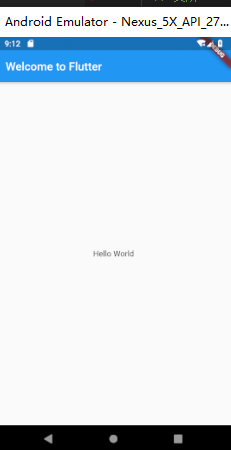
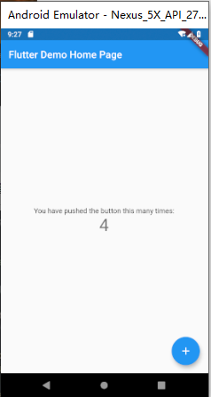

## 命令行

```powershell
# flutter脚手架，类似: vue-cli：vue create vue-cli3 vue_app
flutter create flutter_app
# 类似：npm install
flutter packages get
# 类似：npm run dev
flutter run
```


## HelloWorld

开始写一个根组件 app.vue，来挂载一下

```dart
// 安卓风格样式库，类似: import ElementUI from 'element-ui';
import 'package:flutter/material.dart';

// 主函数（入口函数）
void main() =>runApp(MyApp());

// StatelessWidget 类似：函数式组件，没有状态，依据prop来展示
class MyApp extends StatelessWidget{
  // 类似：react的render函数
  @override
  Widget build(BuildContext context){
   // App级别的组件，设置如：app的名字、router、store
   return MaterialApp(
      title:'Welcome to Flutter',
      // 页面级别的组件，顶部、导航、左滑窗口
      home:Scaffold(
        appBar:AppBar(
          title:Text('Welcome to Flutter'),
        ),
        body:Center(
          child:Text('Hello World'),
        ),
      ),
    );
  }
}
```

代码效果如下：




## 计数器

接着写一个页面组件

```dart
import 'package:flutter/material.dart';

void main() {
  runApp(MyApp());
}

class MyApp extends StatelessWidget {
  @override
  Widget build(BuildContext context) {
      
    return MaterialApp(
      title: 'Flutter Demo',
      theme: ThemeData(
        primarySwatch: Colors.blue,
        visualDensity: VisualDensity.adaptivePlatformDensity,
      ),
      home: MyHomePage(title: 'Flutter Demo Home Page'),
    ); 
  }
}

// 一般的组件，有状态组件
class MyHomePage extends StatefulWidget {
  MyHomePage({Key key, this.title}) : super(key: key);
    
  // 类似：vue的 prop
  final String title;
  
  // 类似：vue的 state
  @override
  _MyHomePageState createState() => _MyHomePageState();
}

class _MyHomePageState extends State<MyHomePage> {
  int _counter = 0;
  
  void _incrementCounter() {
    setState(() {
      _counter++;
    });
  }

  @override
  Widget build(BuildContext context) {
    return Scaffold(
      appBar: AppBar( 
        title: Text(widget.title),
      ),
      // body: display: flex; align-items: center; 组件的默认样式
      body: Center(
        // div: display: flex; flex-direction: column; 
        child: Column(
          // align-items: center;
          mainAxisAlignment: MainAxisAlignment.center,
          children: <Widget>[
            Text(
              'You have pushed the button this many times:',
            ),
            Text(
              '$_counter',
              style: Theme.of(context).textTheme.headline4,
            ),
          ],
        ),
      ),
      floatingActionButton: FloatingActionButton(
        onPressed: _incrementCounter,
        tooltip: 'Increment',
        child: Icon(Icons.add),
      ), 
    );
  }
}
```

代码效果如下：




## 参考手册

老孟的 flutter 组件文档 ：http://laomengit.com/flutter/widgets/widgets_structure.html
